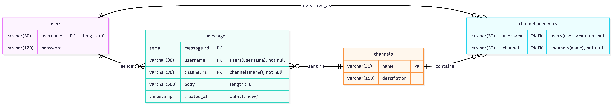
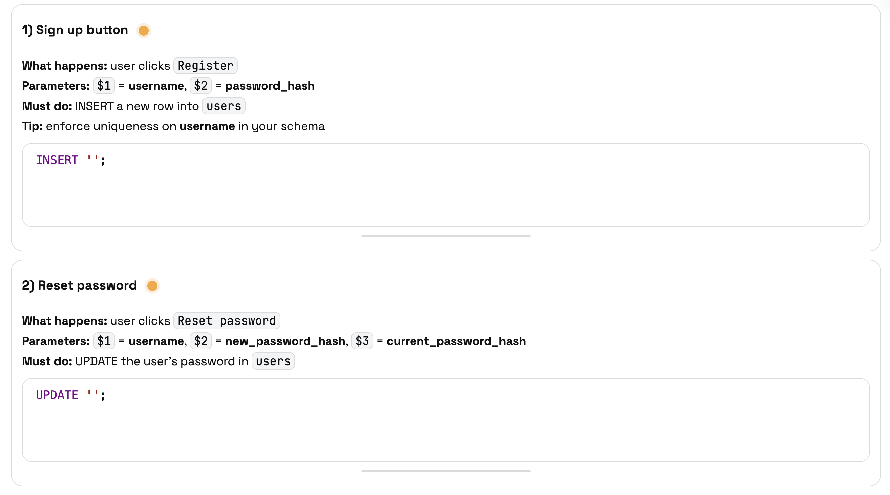
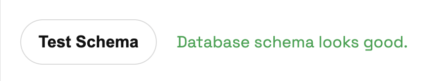
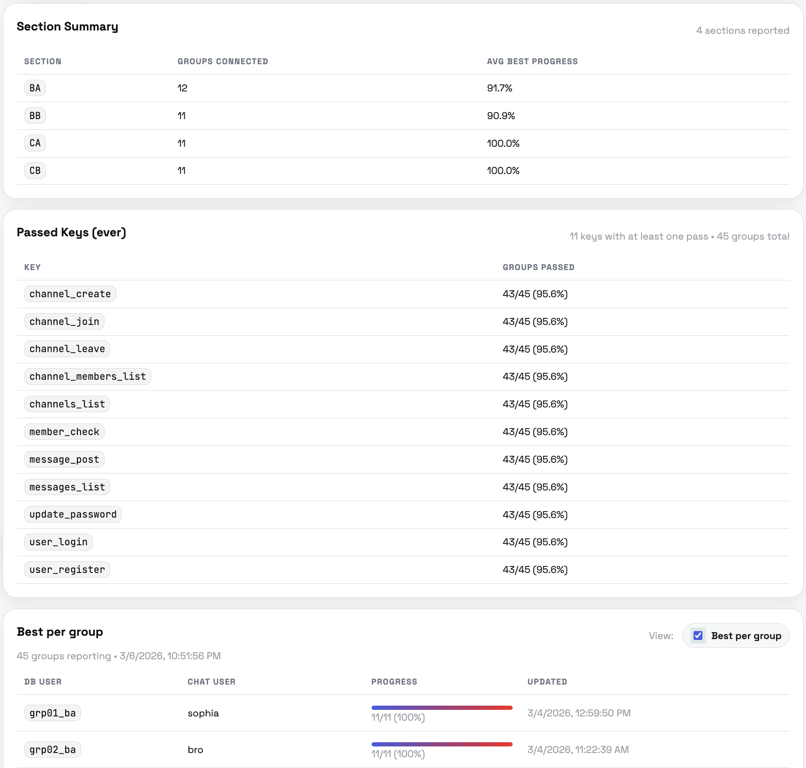

# INFO 330 Project App (Instructor Handoff)

This repository contains the INFO 330 SQL-powered chat app, plus instructor tooling for provisioning group databases, monitoring usage, and grading support.

Students log in with their group database username/password in the app UI. The app behavior depends on the SQL and schema they implement in their own group database.

## Project context

Most apps people use every day (TikTok, Discord, Slack, Facebook Messenger, iMessage) feel like "frontend apps." Underneath, they rely on a database that: stores messages reliably (data persists, even if the app reloads), prevents bad data (constraints, foreign keys, check rules), and returns results in the exact format the app expects (column names, types, and ordering matter).

In this project, students build the database backend using only SQL. A pre-built web app connects to each group's schema and works only if SQL objects are correct.

    Important: Neither the database schema nor the SQL queries that drive frontend data views (for example, loading channels and messages) are pre-implemented; those are student deliverables.

What success looks like: students can open the app, sign up, log in, join channels, post messages, and see those messages appear correctly because the database is doing the work.

What we provide:

- A working web app that reads and posts messages to each group's database schema.
- One private database per group, along with group login credentials.
- Two client environments for connecting to the same database: the INFO 330 SQL Chat App and pgAdmin.

## Schema ERD

Reference ERD for the baseline chat schema:



This ERD is a baseline teaching model, not a rigid requirement. The schema is intentionally flexible and can use natural keys (for example, channel name as PK) or surrogate keys (for example, `channel_id`/`user_id`), based on course coverage.

Students may use supported column-name variants and should alias query outputs to SQL Lab contract names (for example, `SELECT channel_name AS name`).

Implementation scope for students:

- The frontend includes a lightweight sanity check via the `Test Schema` button (the schema-check step). Instructors can adjust this step as scaffolding evolves.
- `Test Schema` validates baseline structure only: core tables, key columns, and required foreign-key relationships must be discoverable (including supported alias names), and basic `SELECT ... LIMIT 0` probes must execute successfully.
- `Test Schema` does not validate full query semantics, business logic, or end-to-end UI behavior.
- Code references: backend route [`GET /api/test_schema` in `src/server.js`](src/server.js#L936), frontend trigger [`testSchemaBtn` click handler in `public/app.js`](public/app.js#L389), and button markup [`Test Schema` in `public/index.html`](public/index.html#L217).
- Beyond that check, students are expected to support only the SQL behavior defined in SQL Lab (query contract and required outputs).
- Students are not required to implement features beyond what SQL Lab and the app contract exercise; adding unsupported schema/features is discouraged.

## SQL Lab Tab

The SQL Lab tab is where students iteratively implement, test, and save the SQL queries that power core app behavior. It serves as the contract surface between backend SQL work and frontend functionality, so students should use it as the primary place to validate required outputs before moving on.



## Recommended Student Scaffolding

This project can be scaffolded in milestones. One example handout is below.

Recommended scaffolding:

- **Milestone 1**: Write down user-facing app requirements, being explicit about the columns used and expected output columns, with a focus on data flow. Complete the ERD and data dictionary so students can envision the data flow.
- **Milestone 2**: Full implementation and simple inserts for `users`, `channels`, and `channel_members`.
  - Milestone 2 `Test Schema` scope: only three tables checked.
    
    
- **Milestone 3**: Full implementation and simple inserts for `messages` (can also be named `chat_inbox`). Include index implementations.
  - Milestone 3 `Test Schema` scope: all four tables checked.
- **Milestone 4**: Full implementation of the SQL Lab tab. Remind students to go back to Milestone 1, where they explained what is needed. Then clean up columns that students realize are not part of the intended data flow (fixing mistakes from Milestone 1).
  - Milestone 4 progress can be tracked at `/instructor` using the instructor token.
  - Instructor dashboard preview (Milestone 4 tracking):
    
- **Milestone 5**: DB population and business queries, including updates to some column types to meet new data-load requirements.
- **Milestone 6**: Reflection.

Public link:
- Milestone details: [Student-facing Google Doc](https://docs.google.com/document/d/1upYG42Qma86mFbseEzACk7b-XjN6ToJfg_MIDR6ffxE)
- `Test Schema` should be adapted to the specific expectations of each milestone.


<br><br>

# Deployment and Architecture

## Why isolation is per-database

Each group gets a separate PostgreSQL database (not just a separate schema). This avoids cross-group catalog visibility in pgAdmin and simplifies the student mental model.

Tradeoff: more roles/databases to manage and more total DB connections. Tune pool sizes and monitor connection usage in production.

## Repository map

- `src/server.js`: Express app and API routes
- `src/utils.js`: SQL contract, default/solution SQL, DB user -> DB mapping
- `src/instructor.js`: instructor-only routes and progress logging
- `src/populate_db.js`: seed/import routes for CSV-driven data population
- `public/`: frontend pages (`index.html`, `instructor.html`, `populate_db.html`) and JS/CSS
- `scripts/`: admin SQL/shell utilities for provisioning and monitoring
- `config/pm2/ecosystem.config.js`: PM2 runtime config
- `config/nginx/site.conf`: Nginx reverse proxy config template
- `data/populate_db/`: default CSV seed files for `/populate_db`
- `submissions/`: SQL snapshots and progress logs

## Complete document index

All markdown docs currently in this repo:

- `README.md` (this file)
- [`docs/DEPLOYMENT.md`](docs/DEPLOYMENT.md): PM2 deployment, health/status verification, status field meanings
- [`docs/SETTINGS.md`](docs/SETTINGS.md): SQL contract alignment rules between server/client
- [`docs/EXTENDING.md`](docs/EXTENDING.md): how to add SQL Lab items, API routes, instructor features
- [`docs/POPULATE_DB.md`](docs/POPULATE_DB.md): populate tool behavior, CSV format, mapping rules
- [`docs/GRADING.md`](docs/GRADING.md): grading-oriented checks and milestone-specific notes
- [`docs/TODO.md`](docs/TODO.md): internal backlog notes
- [`scripts/SCRIPTS.md`](scripts/SCRIPTS.md): admin script catalog and execution examples
- [`handout-option.md`](handout-option.md): local copy of student-facing project handout content

## Prerequisites (new instructor)

- Node.js 18+ and npm
- PostgreSQL connectivity to your course DB host
- `psql` client (for running setup scripts)
- PostgreSQL role with enough privileges to create roles/databases for course setup
- PM2 (required for recommended server deployment)
- Nginx (required for recommended HTTPS student-facing deployment)
- Valid TLS certificate and private key for your server hostname

## Server setup for a new term (student-facing)

### 1) Install dependencies

```bash
npm install
```

### 2) Define admin DB connection variables

Set these in your shell before running provisioning scripts:

```bash
export PGHOST=your-db-host
export PGPORT=your-db-port
export PGUSER=your-admin-user
```

You can also inline values directly in each `psql` command instead of exporting.

### 3) Provision roles/databases (admin step)

Run the core setup scripts (details in [`scripts/SCRIPTS.md`](scripts/SCRIPTS.md)):

```bash
psql -h "$PGHOST" -p "$PGPORT" -U "$PGUSER" -v ON_ERROR_STOP=1 -f scripts/db_setup.sql
psql -h "$PGHOST" -p "$PGPORT" -U "$PGUSER" -v ON_ERROR_STOP=1 -f scripts/setting_demo.sql
```

Optional hardening pass:

```bash
PGHOST="$PGHOST" PGPORT="$PGPORT" PGUSER="$PGUSER" ./scripts/lock_schemas.sh
```

### 4) Update DB mapping if your cohort naming changed

This app uses a static username-to-database mapping in `src/utils.js` (`PGDATABASES_MAPPING`).

If your group usernames/database names differ from the current `grpXX_section` pattern, update that mapping before running the app.

- Every DB username used by the app must exist in `PGDATABASES_MAPPING`.
- Unmapped DB users can cause DB selection/login/status failures.
- If you will use demo mode, ensure `demo` is also mapped.

### 5) Configure environment

Create `.env` from `.env.example`, then edit it:

```bash
cp .env.example .env
```

Generate strong secrets (example):

```bash
openssl rand -hex 32   # SESSION_SECRET
openssl rand -hex 32   # INSTRUCTOR_TOKEN
```

Minimum values to set for a new deployment:

- `PGHOST`
- `PGPORT`
- `PORT` (default `3000`; must match your reverse-proxy upstream)
- `NODE_ENV=production`
- `SESSION_SECRET` (new random value)
- `HEALTHCHECK_DB_USER`
- `HEALTHCHECK_DB_PASS`
- `INSTRUCTOR_TOKEN` (new random value if you use instructor endpoints)
- `REAL_DEMO_PASSWORD` (required if you will use `ALLOW_SUPERUSER_MODE=true`)

Important:

- Rotate all secrets/tokens/passwords for your deployment.
- Keep `ALLOW_SUPERUSER_MODE=false` during normal student-facing operation.
- `SQL_SUBMISSIONS_DIR` and `SQL_PROGRESS_LOG` can stay at defaults unless you need custom paths.

Demo mode (optional):

- Provision the demo DB first (run [`scripts/setting_demo.sql`](scripts/setting_demo.sql) and load demo tables/query definitions, e.g., from `solutions/solution_channel_name_pk`).
- Keep `demo` access instructor-only; use it only for intentional live demos.
- Superuser solution mode is triggered by `ALLOW_SUPERUSER_MODE=true` and logged-in DB user `demo`.
- If app login uses DB credentials `demo/demo` in superuser mode, the app authenticates to PostgreSQL with `REAL_DEMO_PASSWORD` and executes `SOLUTION_SQL` from [`src/utils.js`](src/utils.js).
- Set the actual PostgreSQL password for role `demo` to `REAL_DEMO_PASSWORD` (not `demo`) so direct pgAdmin/psql login with `demo/demo` fails.
- If `ALLOW_SUPERUSER_MODE=true` but `REAL_DEMO_PASSWORD` is missing/incorrect, demo login requests will fail DB authentication.

### 6) Start app on the server (PM2)

```bash
pm2 start config/pm2/ecosystem.config.js --env production
pm2 save
pm2 startup
```

Run the command printed by `pm2 startup` so PM2 restarts on server reboot.

### 7) Configure Nginx + HTTPS

Use `config/nginx/site.conf` as a template:

- set your server hostname
- install a valid TLS certificate for that hostname (for example, Let's Encrypt)
- set `ssl_certificate` and `ssl_certificate_key` paths
- proxy traffic to `http://127.0.0.1:3000`
- enable HTTP -> HTTPS redirect
- allow inbound `80/443` in firewall/security groups
- keep port `3000` private (only Nginx should be public)

Then validate and reload:

```bash
nginx -t
sudo systemctl reload nginx
```

Students should use your HTTPS URL (for example: `https://<your-hostname>`).

## PM2 command reference

Use these commands after initial setup for day-to-day server operations. Initial start is in setup step 6.

`npm` wrappers from `package.json`:

```bash
npm run pm2:logs
npm run pm2:restart
npm run pm2:save
```

What each wrapper runs:

- `npm run pm2:restart` -> `pm2 restart info330 --update-env` (`info330` is the app name in `config/pm2/ecosystem.config.js`)
- `npm run pm2:logs` -> `pm2 logs info330`
- `npm run pm2:save` -> `pm2 save`

Deployment details and verification are documented in [`docs/DEPLOYMENT.md`](docs/DEPLOYMENT.md).

## Verify runtime health (server)

Internal checks (on server):

```bash
curl -s http://localhost:3000/health
curl -s http://localhost:3000/status
```

Public checks (student-facing URL):

```bash
curl -s https://<your-hostname>/health
curl -s https://<your-hostname>/status
```

Expected:

- `/health` returns `{"ok":true}` when app is up
- `/status` returns build/runtime/db diagnostics (see [`docs/DEPLOYMENT.md`](docs/DEPLOYMENT.md))

## Post-deploy smoke test (student-facing)

Run this once after each deploy/restart:

1. Open `https://<your-hostname>` and confirm the login page loads without console/network errors.
2. Log in with a known group DB account and confirm the main app shell loads.
3. Open SQL Lab and run a safe read-only query template; confirm the request succeeds and UI updates.
4. Open `/populate_db` and confirm the page loads, default CSVs are visible, and preview works.
5. Open `/instructor` and confirm instructor data loads when `INSTRUCTOR_TOKEN` is provided.
6. Call `https://<your-hostname>/status` and verify `ok: true` plus expected DB stats fields.
7. Check PM2 logs for startup/runtime errors:

```bash
pm2 logs info330 --lines 100
```

## Optional local development run

If you are testing or prototyping changes locally (not student-facing):

```bash
npm start
```

Open `http://localhost:3000`.

## Instructor workflow quick start

1. Start app.
2. Log in with a group DB user on the main page.
3. Use SQL Lab to validate query contract progress.
4. Use `/instructor` for instructor views (requires `INSTRUCTOR_TOKEN`).
5. Use `/populate_db` to seed sample data when needed.

Related docs:

- SQL contract and error tagging: [`docs/SETTINGS.md`](docs/SETTINGS.md)
- Extension patterns: [`docs/EXTENDING.md`](docs/EXTENDING.md)
- Populate tool details: [`docs/POPULATE_DB.md`](docs/POPULATE_DB.md)
- Grading-oriented checks: [`docs/GRADING.md`](docs/GRADING.md)

## Common operations

Run contract checker:

```bash
npm run check:contract
```

Tail PM2 logs:

```bash
npm run pm2:logs
```

Monitor DB usage (admin):

```bash
psql -h "$PGHOST" -p "$PGPORT" -U "$PGUSER" -v ON_ERROR_STOP=1 -f scripts/monitor_usage.sql
```

## Common pitfalls

- Login succeeds but app features fail: usually schema/query contract mismatch, missing constraints, or wrong database.
- `status` endpoints fail DB stats: healthcheck user/password in `.env` are wrong or user lacks access.
- Unexpected demo behavior: `ALLOW_SUPERUSER_MODE` enabled when it should be disabled.
- New term users cannot log in: `PGDATABASES_MAPPING` not updated for new cohort naming.

## Notes on config files

- PM2 config: `config/pm2/ecosystem.config.js`
- Nginx reverse proxy template: `config/nginx/site.conf`

Adjust Nginx hostnames and certificate paths for your environment.

## Version context

Last course context in this repo:

- INFO 330, Winter 2026
- 60 groups (sections `ba`, `bb`, `ca`, `cb`) plus `demo` and `test0`

Treat this as a baseline and update naming, credentials, and mapping for future terms.

## Instructor-ready checklist

Use this before opening the project to students.

### Core readiness (server deployment)

- [ ] `npm install` completed with no errors.
- [ ] DB provisioning scripts ran successfully: `scripts/db_setup.sql`, `scripts/setting_demo.sql`, optional `scripts/lock_schemas.sh`.
- [ ] `src/utils.js` `PGDATABASES_MAPPING` matches this term's group usernames/database names.
- [ ] `.env` configured for this term (`PGHOST`, `PGPORT`, rotated `SESSION_SECRET`, valid `HEALTHCHECK_DB_USER`/`HEALTHCHECK_DB_PASS`, rotated `INSTRUCTOR_TOKEN`, `ALLOW_SUPERUSER_MODE=false`).
- [ ] `ALLOW_SUPERUSER_MODE=false` re-confirmed immediately before opening student access.
- [ ] Internal health endpoints pass on the server (`http://localhost:3000/health`, `http://localhost:3000/status`).
- [ ] Public health endpoints pass via Nginx/TLS (`https://<your-hostname>/health`, `https://<your-hostname>/status`).
- [ ] Post-deploy smoke test completed on the public URL.
- [ ] Instructor login flow works with a real group DB user/password.
- [ ] SQL Lab loads and can save/run templates.
- [ ] `/populate_db` page loads and can preview default CSVs.
- [ ] `/instructor` page is accessible with `INSTRUCTOR_TOKEN`.
- [ ] Demo behavior verified intentionally (only if needed for class demos).
- [ ] Public student handout link is current and shared with students.

### Server readiness (PM2 + Nginx + TLS)

- [ ] PM2 started from config file: `pm2 start config/pm2/ecosystem.config.js --env production`.
- [ ] PM2 process `info330` is online and logs are clean (`pm2 logs info330`).
- [ ] PM2 persistence configured (`pm2 save` and `pm2 startup` run for reboot survival).
- [ ] Nginx site config adapted from `config/nginx/site.conf` with correct hostname and certificate paths.
- [ ] TLS certificate is valid (not expired), matches the hostname, and key/cert paths resolve correctly.
- [ ] Firewall/security groups allow inbound `80/443` and do not expose `3000` publicly.
- [ ] Nginx upstream targets local app port (`127.0.0.1:3000`) only.
- [ ] `nginx -t` passes and Nginx reload succeeds.
- [ ] HTTPS is active and HTTP redirects to HTTPS.
- [ ] Reverse proxy works end-to-end (`https://<your-hostname>/health` returns `{"ok":true}`).
- [ ] Server deployment checks in `docs/DEPLOYMENT.md` have been run.
